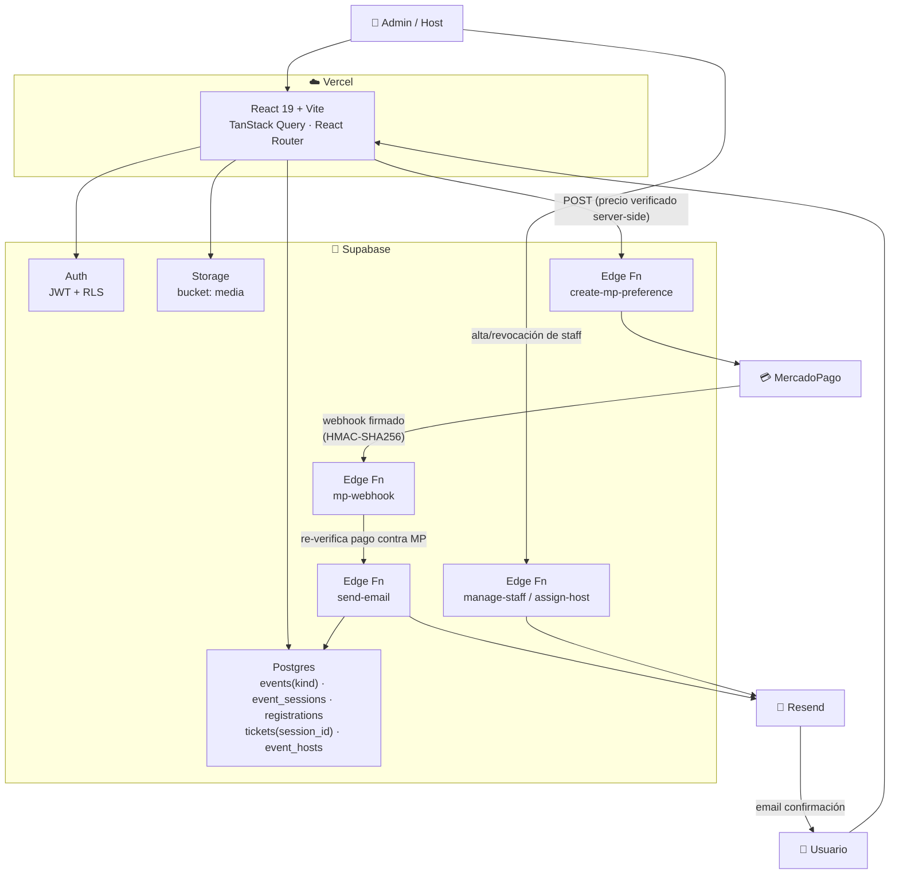
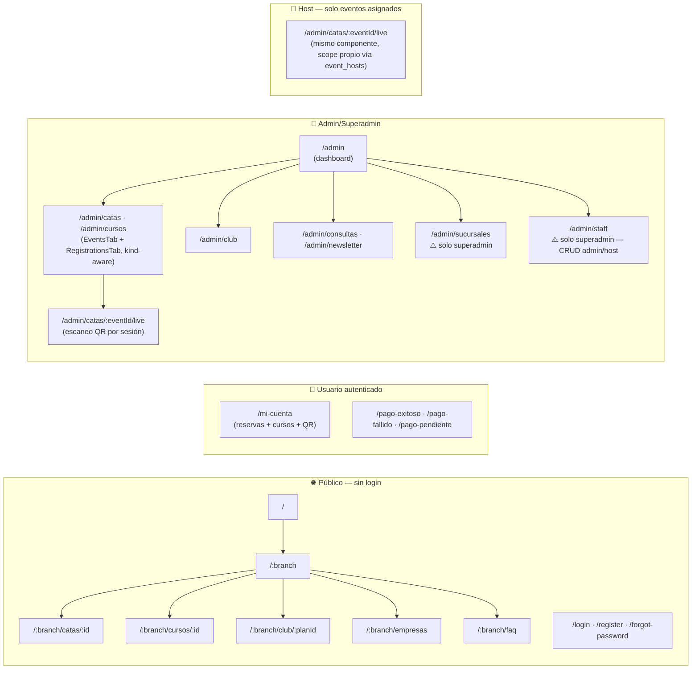
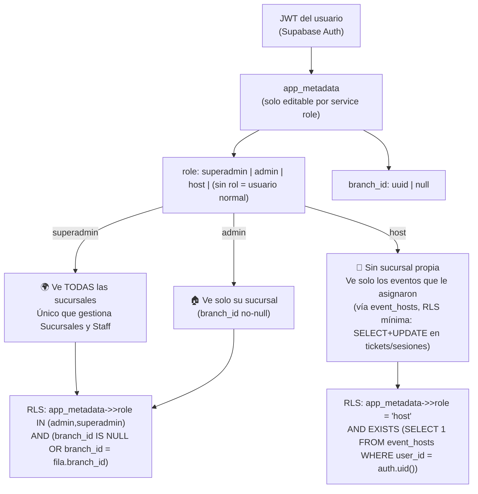
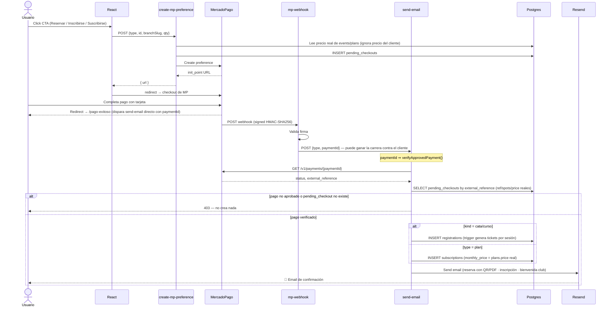
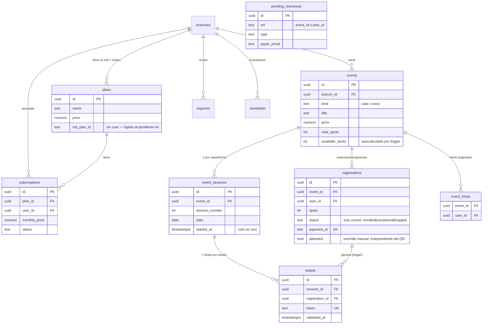

# Architecture Diagrams — Lo de Granados v2

Actualizado 2026-07-04 tras la unificación catas/cursos (Fases 1-4) y la auditoría de seguridad del mismo día. Antes había 6 diagramas, incluyendo uno de "flujo de autenticación" genérico (JWT + refresh token) que no describía nada específico de este proyecto — se sacó. Los 4 que quedan cubren lo que realmente importa: arquitectura, rutas/permisos, el modelo de roles (ahora con `host`), y el flujo de pago (el más crítico, y el que más cambió).

## 1. Arquitectura general

---

## 2. Mapa de rutas y permisos

`catas` y `cursos` son la misma tabla `events` (columna `kind`) desde la unificación — dos rutas públicas distintas, un solo CRUD de admin (`EventsTab.tsx`/`RegistrationsTab.tsx`, parametrizado por `kind`).

---

## 3. Modelo de roles

Altas de `admin`/`host` se hacen desde `/admin/staff` (`manage-staff`, superadmin-only) — dispara mail de confirmación de cuenta + mail de bienvenida. La asignación de un host a un evento puntual es aparte (`assign-host`, admin/superadmin de esa sucursal) y dispara un mail de aviso.

---

## 4. Flujo de pago completo

El paso más importante de este diagrama: `send-email` **no confía en que el pago se aprobó** solo porque lo llamaron — vuelve a verificar contra la API real de MercadoPago antes de escribir nada (`registrations`/`subscriptions`/tickets). Antes del 2026-07-04, esto no pasaba y era explotable con la anon key pública.

⚠️ **El Club DeVinos no cobra de forma recurrente todavía** — este flujo genera una sola fila `subscriptions` activa tras un pago único; no hay PreApproval real de MercadoPago conectado (`create-mp-subscription` existe pero nada la llama). Pendiente a propósito, ver memoria del proyecto.

---

## 5. Diagrama ER (base de datos, simplificado)

Solo tablas activas y sus relaciones clave — no todas las columnas. `courses`/`enrollments` existen todavía en la DB (congeladas, sin lectores/escritores) pero no se muestran acá porque no son parte del modelo vigente.

