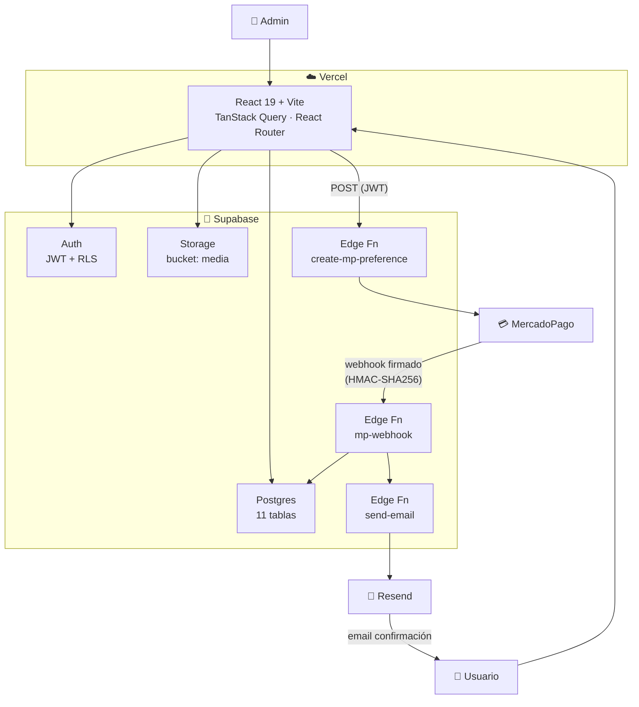
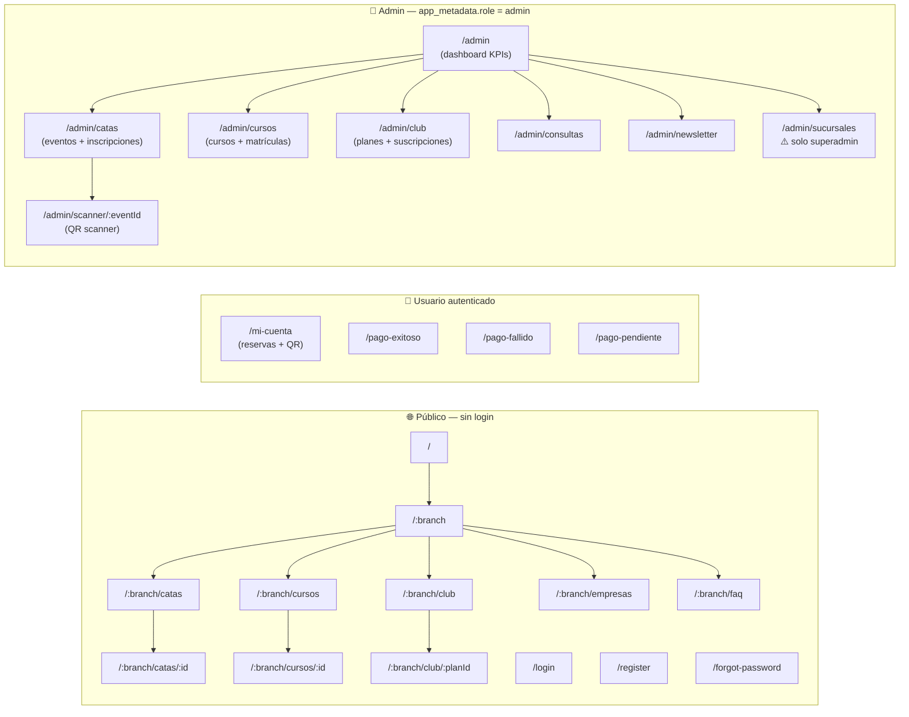
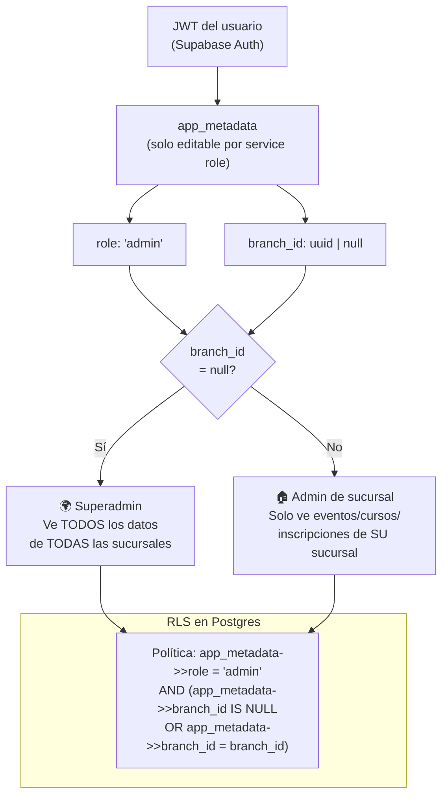
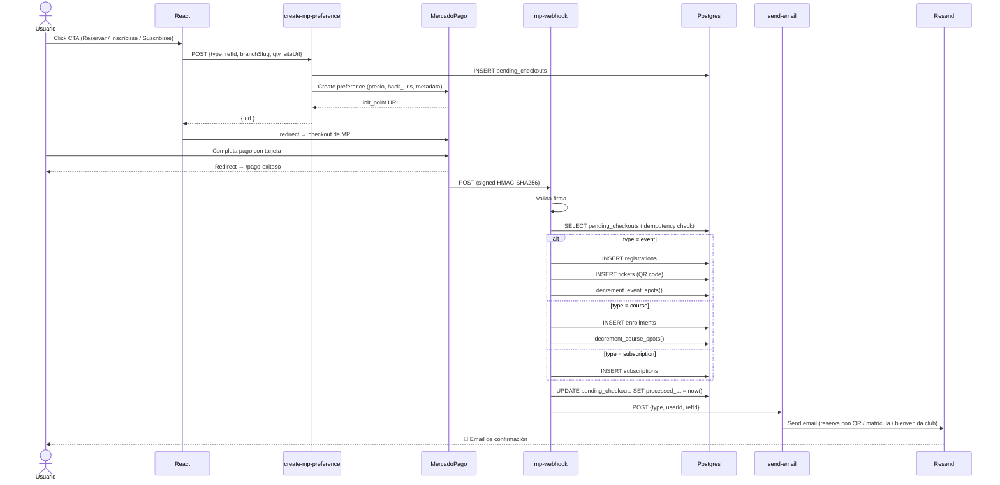
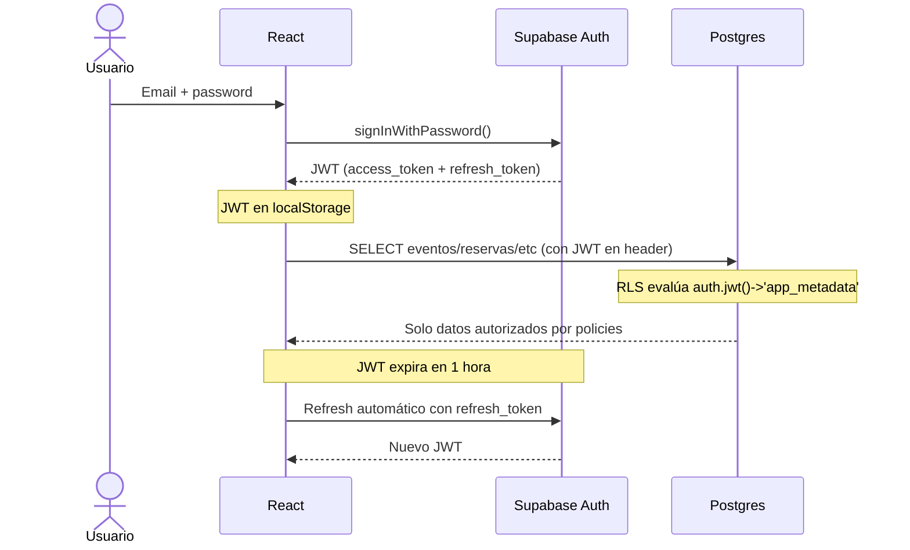
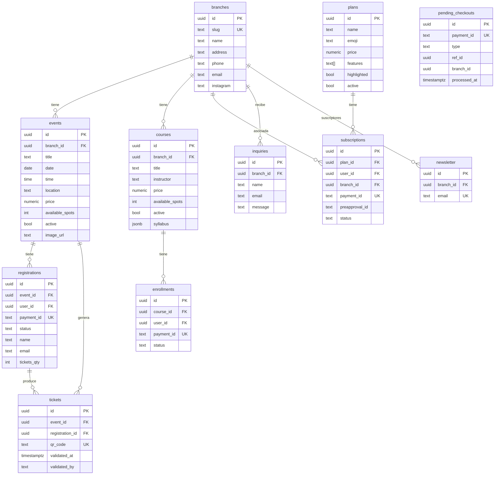

# Architecture Diagrams — Lo de Granados v2

## 1. Arquitectura general

---

## 2. Mapa de rutas y permisos

---

## 3. Modelo de permisos de admin

---

## 4. Flujo de pago completo

---

## 5. Flujo de autenticación

---

## 6. Diagrama ER (base de datos)

